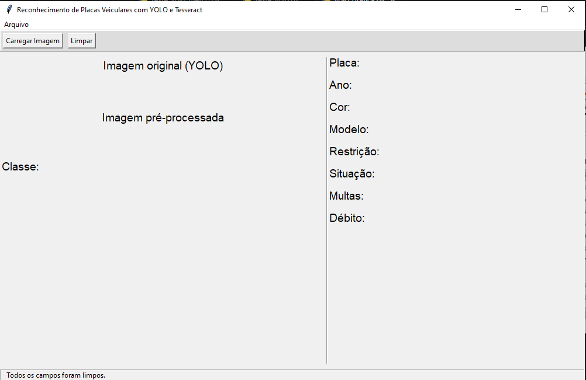
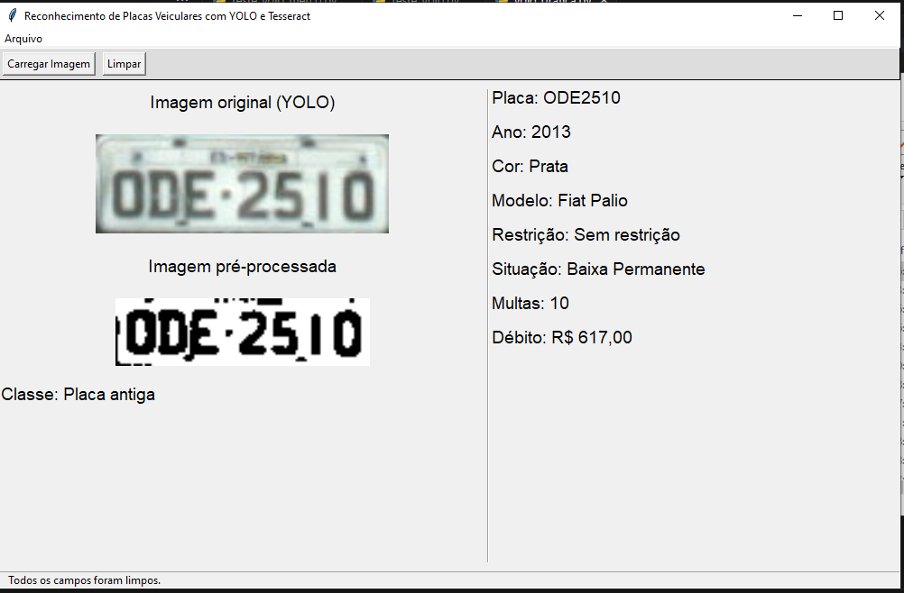

# 🚀 Trabalho de Conclusão de Curso - Reconhecimento de Placas Veiculares

          

---

## 📖 Sobre o Projeto  

Este repositório contém o código desenvolvido para o meu **Trabalho de Conclusão de Curso (TCC)** no curso de **Bacharelado em Ciência da Computação**, com o objetivo de **detectar e reconhecer placas de veículos em imagens**.  

O projeto utiliza técnicas de **Visão Computacional**, **Aprendizado de Máquina** e **Processamento de Imagens** para identificar e interpretar placas de veículos, com foco nos padrões **brasileiros** e **Mercosul**.  

Além do código-fonte, este repositório também contém:  
✅ **Redes YOLO** treinadas para detecção de placas.  
✅ **Fontes treinadas para o Tesseract OCR** (Mandatory e Fe-Font).  
✅ **Back-end de simulação da API do SENATRAN**.  
✅ **Artigo científico** publicado como parte do TCC.  

---

## 🚀 Tecnologias Utilizadas  

- **Python** 🐍 - Para processamento de imagens e interface gráfica.  
- **JavaScript** 💻 - Para o desenvolvimento do back-end com **Node.js** e **Express**.  
- **YOLO (You Only Look Once)** 🎯 - Para detecção das placas de veículos.  
- **OpenCV** 🖼️ - Para pré-processamento das imagens.  
- **Tesseract OCR** 🔠 - Para reconhecimento óptico de caracteres (OCR).  
- **EasyOCR** 🔍 - Para complementar o reconhecimento de caracteres.  
- **Scikit-Image & Pillow** 🖌️ - Para manipulação e aprimoramento das imagens.  
- **Tkinter** 🖥️ - Para interface gráfica.  
- **Node.js & Express** 🌐 - Para simular um servidor que retorna informações do veículo.  

---

## 🎯 Objetivos  

✔ **Detecção de placas veiculares** 🚗: Localizar a posição das placas em imagens.  
✔ **Reconhecimento de caracteres** 🔠: Identificar os caracteres das placas via OCR.  
✔ **Pré-processamento de imagens** 🖼️: Melhorar a qualidade da imagem antes do OCR.  
✔ **Interface gráfica** 🖥️: Criar uma GUI intuitiva para facilitar o uso do sistema.  
✔ **Simulação da API do SENATRAN** 📊: Consultar dados simulados de veículos.  

---

## 🖼️ Interface Gráfica  

Abaixo estão algumas imagens da interface gráfica desenvolvida com **Tkinter**:  

  
*Tela principal da aplicação.*  

  
*Resultado do reconhecimento de caracteres da placa (dados simulados).*  

Caso prefira, você pode testar o projeto executando localmente!  

---

## 📂 Estrutura do Repositório  

📌 **vehicle-license-plate-recognition**  
├── 📂 **fonte-tesseract**       # 🔤 Fontes treinadas para o Tesseract OCR (Mandatory e Fe-Font)  
├── 📂 **imagens**               # 🖼️ Capturas de tela e demonstrações do projeto  
├── 📂 **placa-api**             # 🌐 Back-end em Node.js simulando API do SENATRAN  
├── 📂 **redes-yolo**            # 🤖 Modelos YOLO treinados para detecção de placas  
├── 📄 **artigo_cientifico.pdf**  # 📚 Artigo científico do TCC  
├── 📄 **README.md**              # 📖 Documentação do projeto  
└── 🐍 **yolo_grafica.py**        # 🖥️ Script principal com interface gráfica

## 📝 Licença  

Este projeto está licenciado sob os termos da **MIT License**.  
